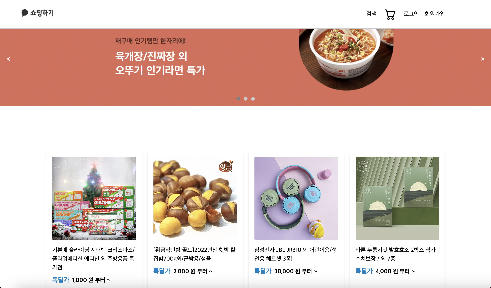

# KAKAO_SHOP_CLONE_CODING

**Project Duration: 7/26 ~ 8/3**

카카오 쇼핑하기 홈페이지 클론 코딩 프로젝트입니다.

This is a clone coding project on the homepage of Kakao Shopping. I made it using [Kakao REST API](http://kakao-app-env.eba-kfsgeb74.ap-northeast-2.elasticbeanstalk.com/docs/api-docs.html).

The deployment was conducted through Crampoline IDE and the link is valid until August 18, 2023.

## About The Project

https://user-app.krampoline.com/kcbd367ee5fe8a



### Directory

- src/apis : 통신 모듈과 개별 API 함수
- src/components : Atomic pattern으로 구성
- src/hooks : custom hooks
- src/layouts : 메인 레이아웃과 조건부 레이아웃
- src/store : redux thunk (about login)
- src/utils : utils function

### Built With

- [![React][React.js]][React-url]
- [![TailwindCSS][TailwindCSS]][Tailwind-url]

## Getting Started

### Prerequisites

1. Clone the repo

```
git clone https://github.com/your_username_/Project-Name.git
```

2. Install npm packages

```bash
npm install
```

```bash
npm run build # 패키지 번들링
npm run start # 프로젝트 실행
```

## Contributing

1. Fork the Project
2. Create your Feature Branch (git checkout -b feat-AmazingFeature)
3. Commit your Changes (git commit -m 'Add some AmazingFeature')
4. Push to the Branch (git push origin feat-AmazingFeature)
5. Open a Pull Request

## Contact

YuJeong Park(@udadai) - yujeong470@gmail.com

Project Link: https://github.com/udadai/KAKAO_SHOP.git

[TailwindCSS]: https://img.shields.io/badge/Tailwind%20CSS-06B6D4?style=flat-square&logo=Tailwind%20CSS&logoColor=white
[Tailwind-url]: https://tailwindcss.com/
[React.js]: https://img.shields.io/badge/React-20232A?style=for-the-badge&logo=react&logoColor=61DAFB
[React-url]: https://reactjs.org/
